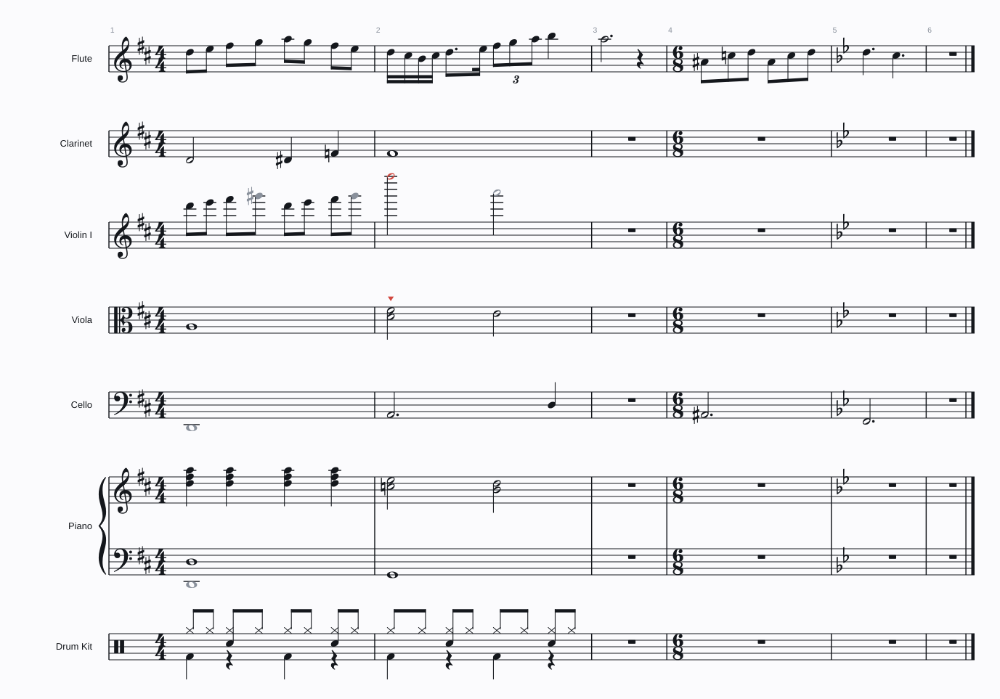

# Noterator

A notation app for the Mac that writes music with you. Most of the music comes
from the family's generators - **Good Idea**, **Midi Catalogue**, **Midi
Suggester**, **Midi Variator** and **Starting Blocks** - and lands on the page
as real notation you can read, edit, play and export.



## What it does

- **A score you can read.** Staves, clefs, key and time signatures, beams,
  stems, accidentals, ties, triplets and rests are worked out from the notes
  automatically, set in Bravura, the standard music font. Notes that sound
  together line up across every instrument.
- **Generators built in.** Choose a generator, press Generate, click a result
  to hear it, press Insert. The generators are your own engines, unchanged,
  with every setting they have in REAPER.
- **It knows the instruments.** A violin and a viola get different clefs,
  ranges and registers, and the generators write differently for each. Notes
  an instrument cannot play turn red; notes outside where it sounds best turn
  grey; a chord on a one-line instrument, a run faster than it can play, or a
  leap too wide get a red mark - hover over a note to see why.
- **Chords and scales on the timeline.** Two lanes along the top name the
  chords and the scale as you write. Click a chord to hear it, the scale to
  hear the scale, any note to hear it.
- **Write it yourself.** Click notes onto the staff, type letters (A-G) and
  numbers (note values), or play a MIDI keyboard.
- **Hear it.** Plays through the General MIDI orchestra built into macOS - no
  sounds to install - with AutoCC's swells on strings, wind and brass.
- **Take it with you.** Export the whole score or the selected bars as MIDI
  (with all four AutoCC lanes, for sample libraries) or as WAV audio. Drop a
  MIDI file onto the window to bring one in.

## Installing on a Mac

The app is built automatically on GitHub every time the code changes.

1. Open the repository's **Actions** tab on GitHub, click the latest green
   **Build** run, and download **Noterator-macOS** under *Artifacts*. (Once a
   version is tagged, it is also under **Releases**.)
2. Unzip it and open `Noterator-macOS.dmg`. Drag Noterator into Applications.
3. The first time only, **right-click** Noterator in Applications and choose
   **Open**. macOS asks because the app is not yet signed with an Apple
   Developer certificate. If it says the app is "damaged", see
   [docs/INSTALL-MAC.txt](docs/INSTALL-MAC.txt) - it is one line in Terminal.

It needs a Mac with Apple silicon (M1 or later).

## Using it

| | |
| --- | --- |
| Put the caret in a part | click the staff, or the part's name |
| Generate | right-hand panel: choose a generator, **Generate**, click a result to hear it, **Insert** |
| Write notes | **N** for note input, then click the staff, type **A-G**, or play a MIDI keyboard |
| Note values | **1-7** (5 is a quarter, 6 a half, 4 an eighth), **.** dot, **T** triplet, **0** rest |
| Add to a chord | **Shift** + letter, or Shift-click |
| Select | click a note; drag across the page for several; double-click for a whole chord |
| Change notes | **Up/Down** a semitone, **Cmd+Up/Down** an octave, drag a note up or down, **Delete** |
| Hear | **Space** plays from the selection or the caret; click any note or chord |
| Undo | **Cmd+Z**, **Shift+Cmd+Z** |
| All the keys | **H** |

The **Parts** tab adds and removes instruments, and shows what each one can
do. The **Score** tab sets the title, tempo, time signature and key.

## Where it is going

Next, roughly in order:

- a page view (systems on pages, a title) beside the scrolling galley;
- dynamics, articulations and slurs, and articulation switching for sample libraries;
- CC lanes you can draw on, beside the automatic ones;
- VST3 and CLAP instruments per part, and SoundFonts through the Mac's synth;
- MusicXML export, to take a score into Dorico, Sibelius or MuseScore;
- Windows.

## For developers

```sh
# the core and its tests: no JUCE, seconds
cmake -B build-core -G Ninja -DNOTERATOR_BUILD_APP=OFF && cmake --build build-core
ctest --test-dir build-core --output-on-failure

# the generators, outside the app
lua5.4 tools/try_generators.lua

# everything: the app and the PNG renderer (downloads JUCE)
cmake -B build -G Ninja -DCMAKE_BUILD_TYPE=Release && cmake --build build
./build/NoteratorRender_artefacts/Release/NoteratorRender demo page.png 10 light
```

[CLAUDE.md](CLAUDE.md) is the working guide, [docs/decisions](docs/decisions/README.md)
the reasons behind it.

## Credits

- The generators are KallumS's Good Idea, Midi Catalogue, Midi Suggester, Midi
  Variator and Starting Blocks; chord naming is ScaleView's; AutoCC's curves
  are AutoCC's.
- [Bravura](https://github.com/steinbergmedia/bravura) by Steinberg, SIL Open
  Font License. [Lua](https://www.lua.org) 5.4, MIT. [JUCE](https://juce.com) 8.
