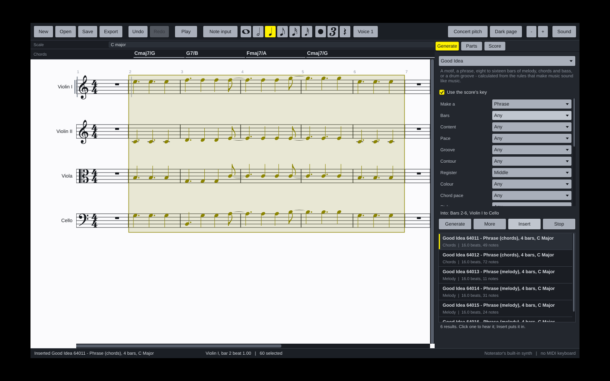

# Noterator

A notation app for the Mac that writes music with you. Most of the music comes
from the family's generators - **Generate Notes** (Good Idea) first, **Suggest
Notes** (Midi Suggester) for ideas around what you have, **Vary Notes** (Midi
Variator) to change it, and **Starting Blocks** as a toolbox of chords,
arpeggios, runs and intervals - and lands on the page as real notation you
can read, edit, play and export.



## What it does

- **A score you can read.** Staves, clefs, key and time signatures, beams,
  stems, accidentals, ties, triplets and rests are worked out from the notes
  automatically, set in Bravura, the standard music font. Notes that sound
  together line up across every instrument.
- **Generators built in.** Drag across some bars, choose a generator, press
  Generate, click a result to hear it, press Insert: the music fills exactly
  those bars. Choose several parts and it is orchestrated: in each section
  the tune goes to the top instrument, the bass to the bottom one (the double
  bass an octave under the cellos), the chord's other notes to the ones
  between, each moving as little as it can - choose a whole orchestra and
  every part plays. Choose nothing and it is shared across every part from
  the cursor's bar; choose bars of one part and all of it goes there. A tune
  on its own goes to one part, and chosen bars are filled once - never
  repeated, never past their end. The generators are your own engines,
  unchanged, with every setting
  they have in REAPER. Every instrument gets only what it can play: a violin
  never gets chords, only their top line.
- **Starting Blocks as a toolbox.** Pick a chord, arpeggio, run or interval;
  every degree of the key is a button. Click one to see and hear it, Insert to
  put it at the caret - then the next one goes after it. (Drum grooves come
  from Generate Notes.)
- **Start from an ensemble.** New offers small groups (string quartet, wind
  and brass quintets, choir, band, jazz combo), whole orchestral sections
  (strings, woodwinds, brass, percussion), a chamber or full orchestra, and a
  big band - every instrument with a sound of its own.
- **It knows the instruments.** A violin and a viola get different clefs,
  ranges and registers, and the generators write differently for each. Notes
  an instrument cannot play turn red; notes outside where it sounds best turn
  grey; a chord on a one-line instrument, a run faster than it can play, or a
  leap too wide get a red mark - hover over a note to see why.
- **Chords and scales on the timeline.** Two lanes along the top name the
  chords and the scale as you write. Click a chord to hear it, the scale to
  hear the scale, any note to hear it.
- **Write it yourself.** Click notes onto the staff, type letters (A-G) and
  numbers (note values), or play a MIDI keyboard.
- **Hear it.** Plays through the General MIDI orchestra built into macOS - no
  sounds to install - with AutoCC's swells on strings, wind and brass.
- **Follow the music.** While it plays, the page scrolls smoothly along with
  it, the playhead a third of the way across so you see what is coming. Or
  turn a page at a time, or keep the page still (the **Follow** button).
- **Take it with you.** Export the whole score or the selected bars as MIDI
  (with all four AutoCC lanes, for sample libraries), as MusicXML for Dorico,
  Sibelius, MuseScore or Finale, or as WAV audio. Open or drop in a MIDI or
  MusicXML file (.musicxml, .xml, .mxl) to bring one in.
- **Black on white**, or a dark page if you prefer (**File** > **Dark page**).

## Installing on a Mac

The app is built automatically on GitHub every time the code changes.

1. Open the repository's **Actions** tab on GitHub, click the latest green
   **Build** run, and download **Noterator-macOS** under *Artifacts*. (Once a
   version is tagged, it is also under **Releases**.)
2. Unzip it and open `Noterator-macOS.dmg`. Drag Noterator into Applications.
3. The first time only, **right-click** Noterator in Applications and choose
   **Open**. macOS asks because the app is not yet signed with an Apple
   Developer certificate. If it says the app is "damaged", see
   [docs/INSTALL-MAC.txt](docs/INSTALL-MAC.txt) - it is one line in Terminal.

It needs a Mac with Apple silicon (M1 or later).

### Or build it on your own Mac

`build-mac.command`, at the top of the code, builds Noterator on your Mac and puts
it in Applications - no GitHub build needed.

1. Once: install [Homebrew](https://brew.sh) (copy its one line into
   Terminal). The script installs everything else itself, and offers
   Apple's Command Line Tools if they are missing.
2. Download the code (the green **Code** button, then **Download ZIP**),
   unzip it, and keep `build-mac.command` somewhere handy, such as the
   Desktop.
3. Double-click it (the first time: right-click, **Open**, **Open**). Press
   Return for the latest version, or type a branch name to try one before
   it is merged. The first build takes 10 to 30 minutes; later ones are
   quicker.

Each run fetches the newest code into `~/Developer/Noterator`, so the same file
keeps working for every future version.

## Using it

| | |
| --- | --- |
| Start a score | **File** > **New**: a small group, a whole orchestral section, a chamber or full orchestra, or a big band |
| Bring music in | **File** > **Open**, or drop a MIDI or MusicXML file (.mid, .musicxml, .xml, .mxl) on the window |
| Put the caret in a part | click the staff, or the part's name |
| Choose bars | click an empty bar; drag across bars and staves for more; drag along the Chords lane for every part; **Esc** lets go |
| Generate | **Generate** tab: choose a generator, **Generate**, click a result to hear it, **Insert** - into the chosen bars, or the caret's part |
| Every instrument at once | **Esc** lets go of everything - notes, bars and the instrument - so the next idea goes to every part (a single melody to the top one); click a name to choose one again |
| Blocks | **Blocks** tab: choose a kind, click a degree to see and hear it, **Insert** at the caret |
| Write notes | **N** for note input, then click the staff, type **A-G**, or play a MIDI keyboard |
| Note values | **1-7** (5 is a quarter, 6 a half, 4 an eighth), **.** dot, **T** triplet, **0** rest |
| Add to a chord | **Shift** + letter, or Shift-click |
| Select | click a note; **Shift**-drag for several; double-click for a whole chord |
| Change notes | **Up/Down** a semitone, **Cmd+Up/Down** an octave, drag a note up or down, **Delete** |
| Hear | **Space** plays from bar 1; **Shift+Space** (or **Play**) plays from the caret; click any note or chord |
| Start and end | **\|◀** beside Play (or **Home**) goes back to bar 1; **▶\|** (or **End**) to the end of the music |
| Follow the music | **Follow** (beside Play) scrolls the page along with the music as it plays, the playhead a third of the way across; click it to keep the page still. To turn a page at a time instead: **Play** menu, **Turn a Page at a Time** |
| Take it out | **File** > **Export**: the score or the chosen bars as MIDI, MusicXML or WAV |
| Light or dark | the page is black on white; **File** > **Dark page** turns it round |
| Undo | **Cmd+Z**, **Shift+Cmd+Z**, or **File** > **Undo** |
| All the keys | **H** |

The **Parts** tab adds and removes instruments, and shows what each one can
do. **File** > **This score** sets the title, tempo, time signature, key,
bars and sound.

## Where it is going

Next, roughly in order:

- a page view (systems on pages, a title) beside the scrolling galley;
- dynamics, articulations and slurs, and articulation switching for sample libraries;
- CC lanes you can draw on, beside the automatic ones;
- VST3 and CLAP instruments per part, and SoundFonts through the Mac's synth;
- Windows.

## For developers


```sh
# the core and its tests: no JUCE, seconds
cmake -B build-core -G Ninja -DNOTERATOR_BUILD_APP=OFF && cmake --build build-core
ctest --test-dir build-core --output-on-failure

# the generators, outside the app
lua5.4 tools/try_generators.lua

# everything: the app and the PNG renderer (downloads JUCE)
cmake -B build -G Ninja -DCMAKE_BUILD_TYPE=Release && cmake --build build
./build/NoteratorRender_artefacts/Release/NoteratorRender demo page.png 10 light
```

[CLAUDE.md](CLAUDE.md) is the working guide, [docs/ARCHITECTURE.md](docs/ARCHITECTURE.md)
the shape of it and every big decision, [docs/decisions](docs/decisions/README.md)
the reasons in full, and [docs/NEXT-SESSION.md](docs/NEXT-SESSION.md) the prompt to
carry on in a new session.

**Miderator** ([KallumS/Miderator](https://github.com/KallumS/Miderator)) is
this app with the notation replaced by a piano roll, as Cubase and Ableton
show music. It shares this repository's music code byte for byte - the
score, instruments, templates, generators, playback, files and the core
tests - and copies changes across with its `tools/sync_from_noterator.sh`.
A fix to any of those is made here first.

## Credits

- The generators are KallumS's Good Idea, Midi Catalogue, Midi Suggester, Midi
  Variator and Starting Blocks; chord naming is ScaleView's; AutoCC's curves
  are AutoCC's.
- [Bravura](https://github.com/steinbergmedia/bravura) by Steinberg, SIL Open
  Font License. [Lua](https://www.lua.org) 5.4, MIT. [JUCE](https://juce.com) 8.
